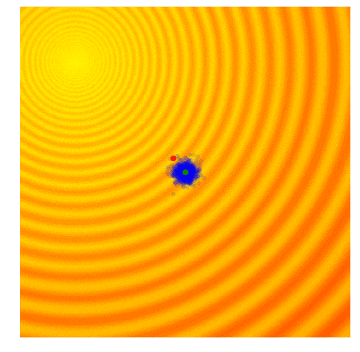
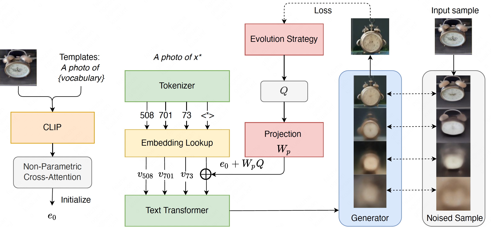
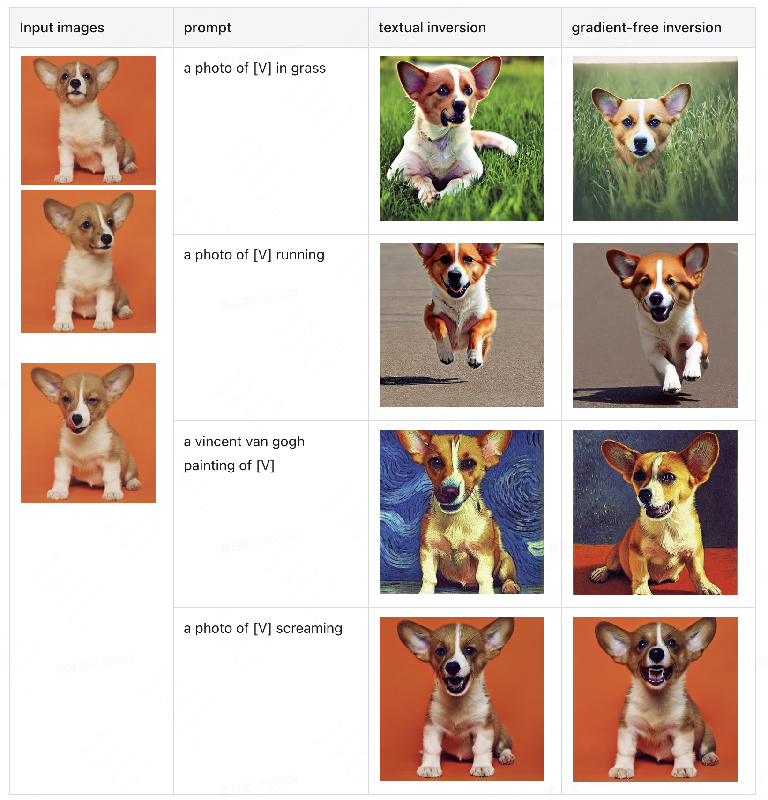

# Gradient-Free Textual Inversion 

Gradient-free textual inversion for personalized text-to-image generation. 
We introduce to use evolution strategy from [OpenAI](https://openai.com/blog/evolution-strategies/) without gradient to optimize the pesudo-word embeddings. 
Our implementation is totally compatible with [diffusers](https://github.com/huggingface/diffusers) and stable diffusion model.

<p align="center">
     
     <br/>
     <sub><em>
     Evolution process for textual embeddings.
    </em></sub>
</p>


## What does this repo do? 

Current personalized text-to-image approaches, which learn to bind a unique identifier with specific subjects or styles in a few given images, usually incorporate a special word and tune its embedding parameters through gradient descent. 
It is natural to question whether we can optimize the textual inversions by only accessing the inference of models?  As only requiring the forward computation to determine the textual inversion retains the benefits of efficient computation and safe deployment. 

Hereto, we introduce a gradient-free framework to optimize the continuous textual inversion in personalized text-to-image generation. 
Specifically, we first initialize the textual inversion with non-parameter cross-attention to ensure the latent embedding space.  
Then, instead of optimizing in the original high-dimensional embedding space, which is intractable for derivative-free optimization, we perform optimization in a decomposition subspace with (i) PCA and (ii) prior normalization through *iterative* evolutionary strategy. 

<p align="center">
     
     <br/>
     <sub><em>
     Overview of the proposed gradient-free textual inversion framework.
    </em></sub>
</p>


## Cases

Some cases generated by standard textual inversion and gradient-free inversion based on stable diffusion model. 


<p align="center">
     
     <br/>
     <sub><em>
     Cases for the personalized text-to-image generation.
    </em></sub>
</p>


## Process


To intialize the textual inversion with cross-attention automatically, run:
```
python initialize_inversion.py 
```

Then, iterative optimize the textual inversion with gradient-free evolution strategy, run:
```
python train_inversion.py 
```

Finally, with the trained textual inversion, you can generated personalized image with ```infer_inversion.py``` script. 


## Acknowledge

This repository is based on [diffusers](https://github.com/huggingface/diffusers) and [textual inversion](https://github.com/huggingface/diffusers/tree/main/examples/textual_inversion) script. Thanks for their clear code. 


